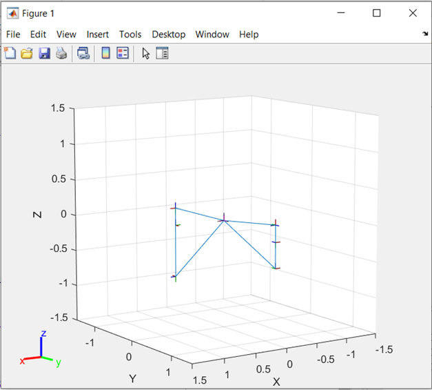
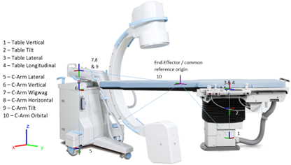

# Kinematic Model of C-Arm and Table (10 DOF)

## Overview
This repository contains a MATLAB implementation of a kinematic model for a C-Arm and Table system with 10 Degrees of Freedom (DOF). The model is based on the Siemens Cios Alpha mobile C-Arm and the Siemens Artis OR Table.

## Requirements
- [MATLAB](https://www.mathworks.com/products/matlab.html)
- [Robotics System Toolbox](https://www.mathworks.com/help/robotics/)

## Getting Started
1. **Install Prerequisites:** Ensure you have MATLAB and the Robotics System Toolbox installed.
2. **Open the Code:** Launch the `Carm_table_10DOF.m` file in MATLAB.

## Code Structure
The `Carm_table_10DOF.m` file is organized into three main sections:

### 1. Rigid Body Tree Model
- The first section creates the kinematic model of the C-Arm and Table using a rigid body tree representation.
- The C-Arm model is based on the Siemens Cios Alpha, and the table is modeled on the Siemens Artis OR Table.
- For more details on rigid body tree models, refer to the [MathWorks documentation](https://www.mathworks.com/help/robotics/ug/rigid-body-tree-robot-model.html).

### 2. Forward Kinematics
- This section computes the forward kinematics of the model.
- **Inputs:** The 10 parameters defining the configuration of the 10 DOF.
- **Outputs:**
  - `fktform`: The homogeneous transformation matrix between the C-Arm end-effector and the Table end-effector, which serves as the common origin frame in this model.
  - `fk_Rotation_ZYX`: The Euler angles (Z, Y, X) in degrees.
  - Translation values in `x`, `y`, and `z`.

### 3. Inverse Kinematics
- This section solves the inverse kinematics of the model.
- **Inputs:** The desired translation (in meters) and rotation (in radians).
- **Outputs:**
  - `configSoln`: A struct array containing the 10 joint values.
  - The homogeneous transformation matrix and Euler angles, for validating the solution.
- **Algorithm:** The default solver is `BFGSGradientProjection`, but `LevenbergMarquardt` can also be used.

## Visualization
- All variables and results can be visualized in the 3D graph MATLAB Workspace as shown below:

## Acknowledgments
This work was conducted during the summer of 2020 as part of a USRA NSERC grant.
