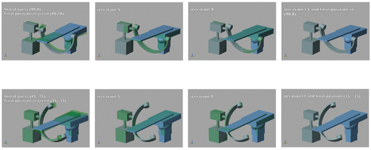

# 10 DOF C-Arm and Table: An Integrated Model

## Overview
This project was conducted during the summer of 2020 as part of an USRA NSERC grant. The aim was to develop a mathematical model of a C-Arm and a table with 10 Degrees of Freedom (DOF). 

## Files
- **Matlab Code (.m file):** Contains the core mathematical model and simulation scripts.
- **Simulink Code (.slk file):** Provides the Simulink model for visualizing and further simulating the system.

- ## Example Output
Here is an example of the output generated by the Simulink model:

## Getting Started
To get started with the project, you can download the Matlab and Simulink files from this repository and load them into your respective software environments.

### Prerequisites
- MATLAB (R2020a or later)
- Simulink

## Usage
1. Open the `.m` file in MATLAB to explore the mathematical model and run simulations.
2. Open the `.slk` file in Simulink for a graphical representation of the model and to simulate the system in an integrated environment.

## Project Details
This model was created to simulate the complex movements and interactions of a C-Arm and an adjustable table, accounting for 10 DOF

## Acknowledgments
- **Natural Sciences and Engineering Research Council of Canada:** For the financial support through the Undergraduate Student Research Awards during the summer of 2020.
- **University of Ottawa/Dr. Pascal Fallavollita:** For providing the support and resources needed for this project.
