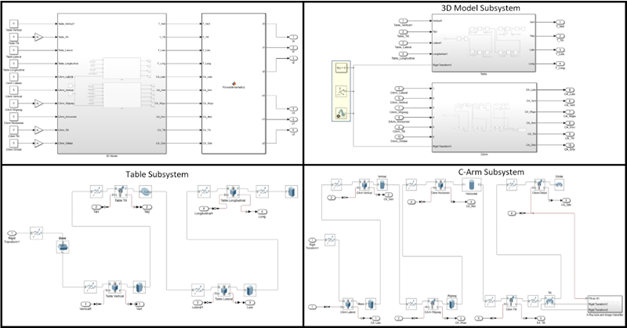

# Kinematic Model of C-Arm and Table (10 DOF)

## Overview
This repository includes a Simulink model for the forward kinematics of a C-Arm and Table system with 10 Degrees of Freedom (DOF). The model is built using MATLAB, Simulink, and relevant toolboxes.

## Requirements
- [MATLAB and Simulink](https://www.mathworks.com/products/matlab.html)
- [Robotics System Toolbox](https://www.mathworks.com/help/robotics/)
- [Simscape Multibody Toolbox](https://www.mathworks.com/products/simmechanics.html)

## Getting Started
1. **Install Prerequisites:** Ensure MATLAB, Simulink, and the required toolboxes are installed.
2. **Open the Code:** Launch the `Cios_Alpha_model_FK.m` file in MATLAB.

## Simulink Model Structure
The Simulink model is structured to simulate the forward kinematics of the C-Arm and Table system:

### 1. Input Configuration
- You can input the joint values for the C-Arm and Table directly in the Simulink model using the Constant block.
- **Joint Assignments:**
  - **Joint 1:** Table Vertical
  - **Joint 2:** Table Tilt
  - **Joint 3:** Table Lateral
  - **Joint 4:** Table Longitudinal
  - **Joint 5:** C-arm Lateral
  - **Joint 6:** C-arm Vertical
  - **Joint 7:** C-arm WigWag
  - **Joint 8:** C-arm Horizontal
  - **Joint 9:** C-arm Tilt
  - **Joint 10:** C-arm Orbital

### 2. Model Components
- The first block of the Simulink model contains the 3D models of the C-Arm and Table, which are connected to a common 3D world frame.
- The second block includes the code for computing the forward kinematics.

### 3. Subsystems
- **C-Arm and Table Model:** These subsystems represent the physical configuration and are linked to the MATLAB solver and the mechanical configuration block.

## Visualization and Output
- When the simulation is run, the translation and rotation of the C-Arm end-effector are outputted.
- The 3D model can be visualized using MATLAB Mechanics Explorer, allowing you to view the system from different angles.

### Example Visualization
Here’s an example of the 3D visualization of the C-Arm and Table model:

## License
This project is licensed under the MIT License - see the [LICENSE](LICENSE) file for details.

## Acknowledgments
This work was conducted during the summer of 2020 as part of a USRA NSERC grant.
